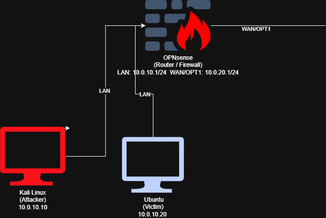
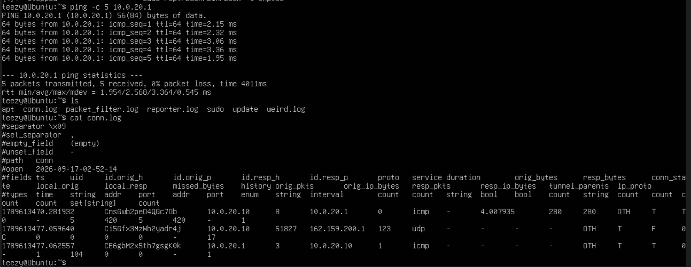
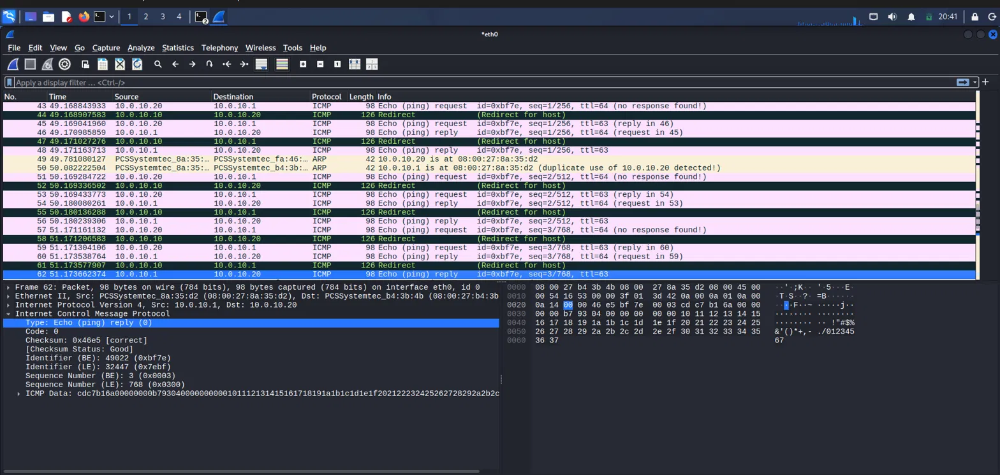
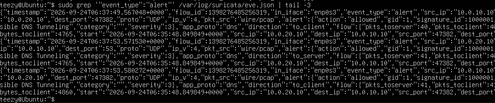
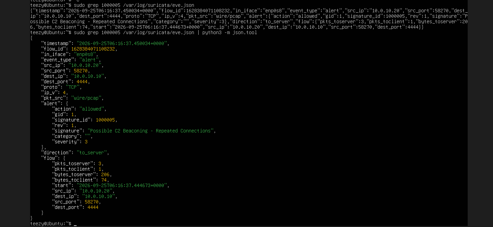
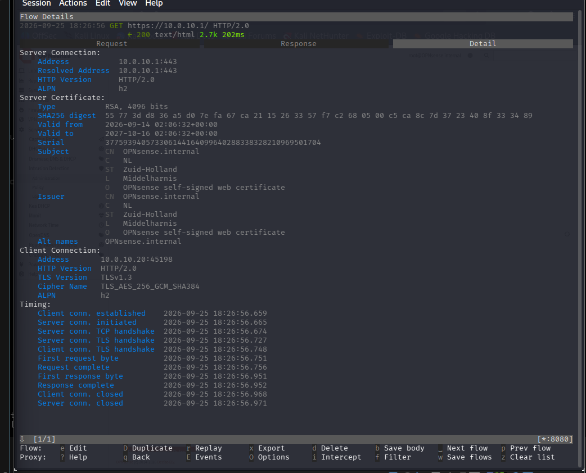
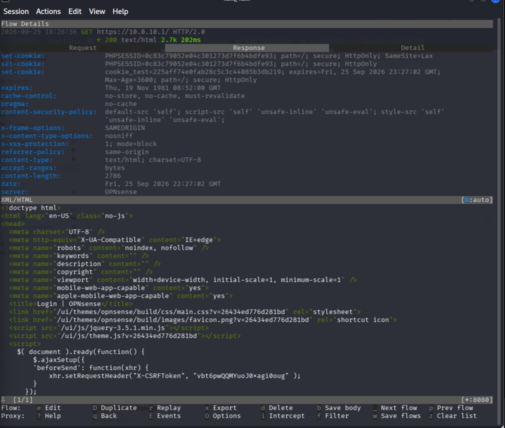

# Packet Detection Lab

Hands-on lab getting practical reps with OPNsense, Wireshark, and Zeek. A segmented network (OPNsense as router/firewall between an attacker box and a victim/internal segment) where I capture and analyze real attack traffic, then build detections on top of it.

## Topology

OPNsense routes and separates segment-a (Kali attacker, Ubuntu victim) from the isolated segment-b (WAN/OPT1).

## What's In Here

- OPNsense setup, two-segment topology, routing, and firewall rules
- Baseline traffic, Wireshark + Zeek capturing normal traffic before any attacks run
- Attack captures, ARP spoofing, DNS tunneling, and C2 beaconing, each manually walked through in Wireshark at the byte level
- Detection, standalone Suricata (on the victim host) running in alert-only/IDS mode with custom rules for DNS tunneling and C2 beaconing; ARP spoofing detected via Wireshark's built-in duplicate-IP expert info instead, since this Suricata build doesn't support ARP as a protocol
- TLS interception demo, MITM on my own traffic via mitmproxy, decrypted, showing what becomes visible
- Incident report, final writeup mapping all four scenarios to MITRE ATT&CK

## Stack

`Wireshark` `Zeek` `Suricata` `OPNsense` `Kali Linux` `mitmproxy`

No SIEM here, on purpose. The goal is raw traffic analysis and detection skill, independent of a platform doing the interpretation for me.

## Baseline

Zeek's `conn.log` picking up normal ICMP/UDP traffic before any attacks ran, confirming visibility is working.

## ARP Spoofing

Detected via Wireshark's built-in expert info, which flags the duplicate MAC-to-IP binding automatically.

## DNS Tunneling

Suricata rule matching on the DNS tunneling tool's payload signature, firing repeatedly across the tunnel session.

## C2 Beaconing

Suricata rule using a threshold to catch repeated short connections to a fixed port while suppressing alert fatigue.

## TLS Interception

MITM demo against OPNsense's own HTTPS GUI using mitmproxy, showing the negotiated TLS session and the decrypted session cookies/CSRF token that would otherwise be invisible.

## Repo Structure

- `/topology`, network and firewall setup
- `/baseline`, normal traffic capture and Zeek visibility check
- `/arp-spoofing`, `/dns-tunneling`, `/c2-beaconing`, capture, manual Wireshark walkthrough, and detection rule for each attack
- `/tls-interception`, before/after decryption comparison
- `/incident-report`, final report mapped to MITRE ATT&CK
- `/Screenshots`, evidence screenshots referenced above
